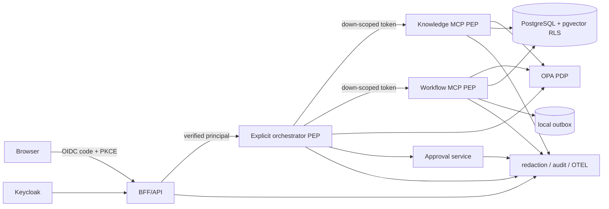

# Architecture

Every arrow crosses an authenticated, authorized trust boundary; internal location conveys no trust. The API token terminates at the BFF. A broker must exchange it for short-lived `aud=mcp-server` credentials; it may not pass the original token. Trusted code, not LangGraph/FakeLLM, constructs policy facts and dispatches immutable metadata. Retrieval filters tenant/ACL before ranking and again afterward; PostgreSQL FORCE RLS supplies a second boundary. Replies only enter a local outbox.

OAuth browser design requires exact pre-registered redirect URIs, Authorization Code plus PKCE S256, random single-use `state`, OIDC `nonce`, server-side sessions, Secure/HttpOnly/SameSite cookies, CSRF tokens, CSP, and frame denial. MCP publishes protected-resource metadata. Production metadata discovery requires HTTPS and pinned allowlisted hosts with each redirect revalidated.

