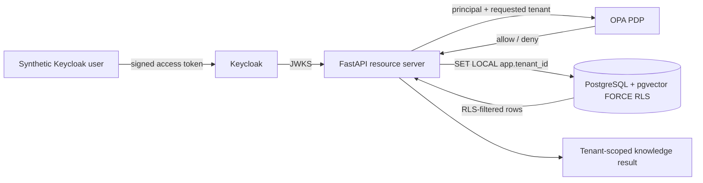
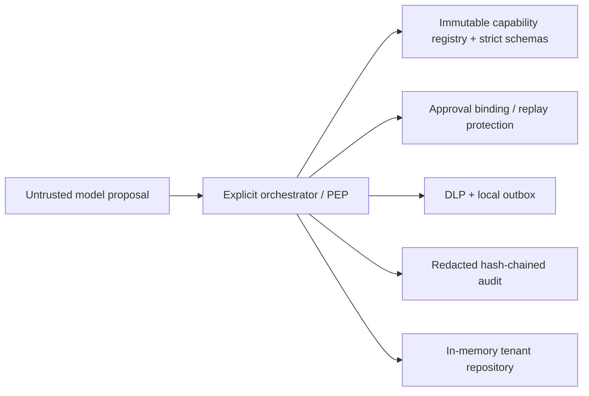

# Architecture

The repository separates **live enforcement**, **implemented in-process controls**, and **target/design-only components** so diagrams do not imply that every box is already deployed.

## Live integration slice

CI exercises `alice-acme` against this path. The API validates the Keycloak signature through JWKS plus issuer, audience, expiry, and tenant claim. OPA then requires principal/resource tenant equality and `kb:read`. On an allowed request, PostgreSQL executes a document query without an application tenant `WHERE` clause after setting `app.tenant_id`; FORCE RLS supplies the independent row boundary. A request by `alice-acme` for Globex is denied by OPA, while the RLS query independently demonstrates that an Acme database session cannot observe Globex rows.

The Keycloak direct-access-grant client exists only to make the synthetic CI integration reproducible. It is **not** the production browser-authentication design.

## Implemented deterministic reference

These controls are exercised by unit, integration, security, and attack-regression tests. Locks, approvals, idempotency, outbox state, and audit state are process-local and are not presented as distributed production guarantees.

## Target architecture — not yet enforcement

The intended next architecture adds a browser BFF using Authorization Code + PKCE, server-side sessions, short-lived/down-scoped token exchange, separate knowledge/workflow MCP servers using the official MCP SDK and Streamable HTTP, durable approval/outbox/audit services, and production workload identity. Those components remain design-only until their paths are executed by CI and added to control traceability.

Every live or future service boundary is treated as authenticated and authorized; network location conveys no trust. Raw user access tokens must not be passed through to downstream MCP servers in the target design.
